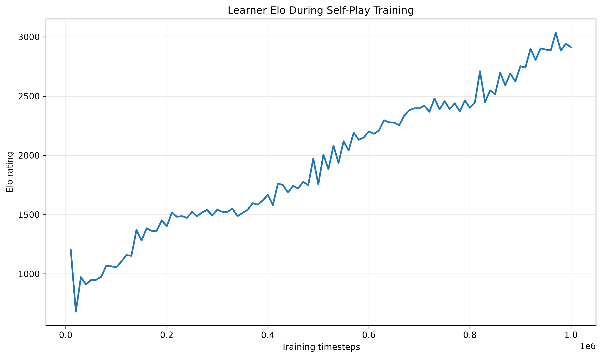
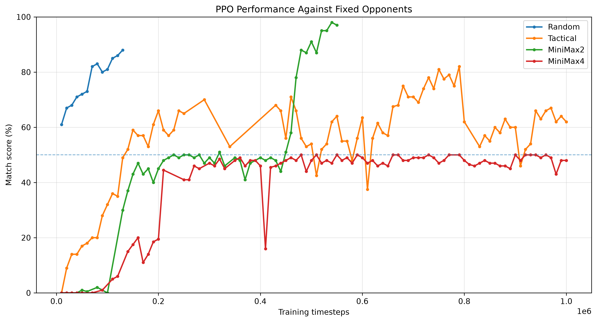
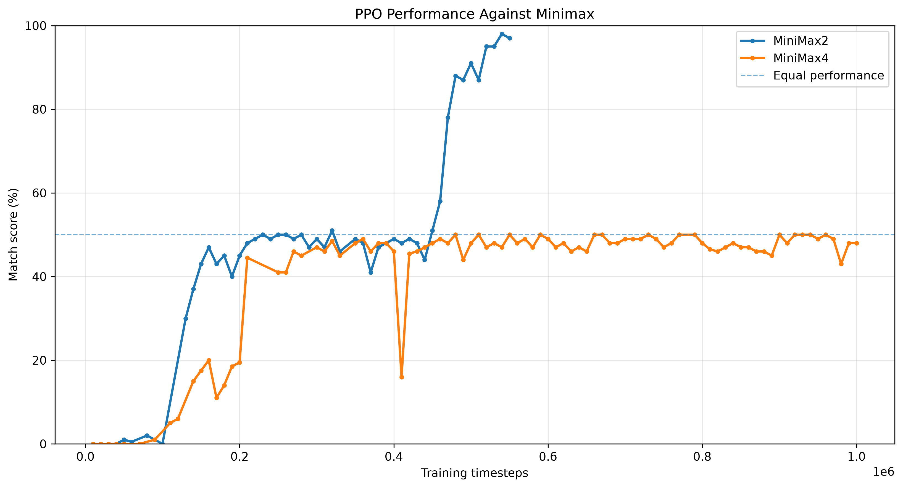
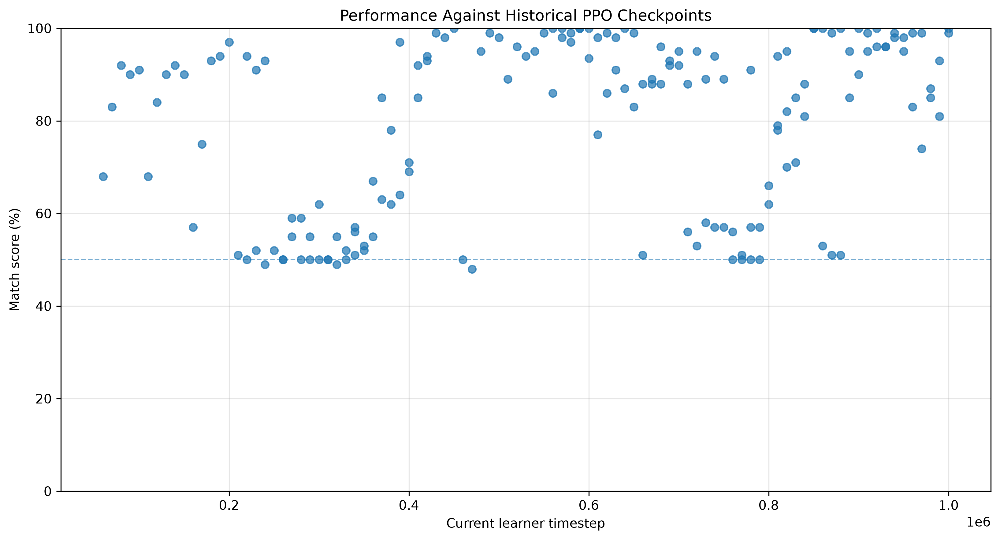

# RL Connect Four

A reinforcement learning project in which a **PPO agent learns to play Connect Four through self-play**, competing against fixed baseline agents and historical versions of itself.

The project explores self-play, adaptive opponent selection, Elo ratings, action masking, and the progression of a reinforcement learning policy from random play toward stronger classical opponents.

## Overview

The agent is trained using **Maskable PPO** from `sb3-contrib` in a custom Gymnasium Connect Four environment.

Rather than training against a single fixed opponent, the learner plays against a dynamic league consisting of:

- Random Agent
- Tactical Agent
- Minimax (depth 2)
- Minimax (depth 4)
- Historical PPO checkpoints

As training progresses, snapshots of the PPO policy are added to the league. This creates a self-play curriculum in which the learner continually encounters both fixed benchmarks and previous versions of itself.

## Key Features

- Custom Connect Four Gymnasium environment
- Maskable PPO reinforcement learning agent
- Legal-action masking
- Self-play training
- Historical PPO checkpoint league
- Elo rating system
- Elo-based opponent selection
- Minimax with alpha-beta pruning
- Random and tactical baseline agents
- Varied starting states for evaluation
- Automated evaluation and CSV logging
- TensorBoard training metrics
- Pytest test suite

## Self-Play

Training and rating are deliberately separated.

During training, PPO plays games against opponents sampled from the self-play league. These games update the neural network but do not directly modify Elo ratings.

At regular intervals, the current learner is evaluated separately against several league opponents.

```text
                   ┌─────────────────┐
                   │   Maskable PPO  │
                   │     Learner     │
                   └────────┬────────┘
                            │
                       training games
                            │
                            ▼
                   ┌─────────────────┐
                   │    Self-Play    │
                   │      League     │
                   └────────┬────────┘
                            │
              ┌─────────────┼─────────────┐
              ▼             ▼             ▼
          Baselines    PPO Checkpoints   Minimax
```

Historical PPO checkpoints allow the training distribution to evolve together with the learner rather than relying entirely on hand-designed opponents.

## Elo Rating

Each league member has an Elo rating representing its estimated playing strength.

The expected score of player A against player B is

$E_A = \frac{1}{1 + 10^{(R_B-R_A)/400}}$

with match scores:

| Result | Score |
| ------ | ----: |
| Win    |   1.0 |
| Draw   |   0.5 |
| Loss   |   0.0 |

Elo evaluation is performed independently of PPO training.

For each rating period:

1. The learner's current rating is frozen.
2. Several opponents are selected.
3. Evaluation games are played against each opponent.
4. Elo changes are calculated from the results.
5. All rating changes are applied after evaluation has finished.

Applying the updates afterwards prevents the order of evaluation opponents from affecting the resulting ratings.

## Opponent Selection

Training opponents are sampled from both fixed baselines and recent PPO checkpoints.

Historical checkpoints are kept within a sliding window so that training primarily occurs against reasonably recent policies.

For Elo-based sampling, opponents closer to the learner's current rating receive higher probability:

$w_i = e^{-\frac{|R_L-R_i|}{T}}$

where:

- $R_L$ is the learner's rating;
- $R_i$ is the opponent's rating;
- $T$ controls how strongly matchmaking favors similarly rated opponents.

This creates a simple adaptive curriculum as the learner improves.

## Minimax Baseline

The project includes a depth-limited Minimax agent with **alpha-beta pruning**.

The heuristic evaluates:

- immediate and potential winning lines;
- opponent threats;
- two- and three-piece combinations;
- center-column control.

Two search depths are used as benchmarks:

```python
MiniMaxAgent(depth=2)
MiniMaxAgent(depth=4)
```

These provide classical game-playing baselines against which the learned PPO policy can be compared.

## Training Results

The final experiment trained the PPO agent for **1,000,000 timesteps**.

During training, the learner was periodically evaluated against fixed baselines and historical PPO checkpoints.

The experiment showed a clear progression in policy strength:

- early policies struggled against tactical and Minimax opponents;
- the learner progressively outperformed older PPO checkpoints;
- performance against the Tactical agent improved substantially;
- Minimax depth 2 changed from a very difficult opponent to one the learner could frequently beat;
- Minimax depth 4 remained the strongest fixed benchmark and approached roughly competitive performance late in training.

The project therefore demonstrates that self-play produced meaningful policy improvement, while also showing that high performance against previous policies does not necessarily imply mastery of Connect Four.

### Learner Elo



The league rating generally increased as training progressed, although Elo should primarily be interpreted as a relative measure within the evolving league.

### Performance Against Fixed Opponents



This plot shows the learner's match score against the fixed baseline agents throughout training.

### Performance Against Minimax



Minimax provides a useful fixed reference because its policy does not change during training.

### Historical Self-Play



Later policies generally outperform older PPO checkpoints, demonstrating improvement within the self-play population.

## Evaluation

Agents can be benchmarked using the evaluation CLI.

For example:

```bash
python -m src.evaluation.run_evaluation \
    --agent ppo \
    --opponent minimax \
    --num-episodes 1000
```

Evaluation tracks:

- wins;
- draws;
- losses;
- win rate;
- performance when playing first;
- performance when playing second;
- average reward;
- average game length;
- illegal actions.

Evaluation can also use varied legal starting states to reduce dependence on repeatedly playing from the empty board.

```bash
python -m src.evaluation.run_evaluation \
    --agent ppo \
    --opponent minimax \
    --num-episodes 1000 \
    --varied-starting-states
```

## Installation

Clone the repository:

```bash
git clone <repository-url>
cd RL-Connect-Four
```

Create the environment:

```bash
conda create -n connect4-rl python=3.11
conda activate connect4-rl
```

Install the dependencies:

```bash
pip install -r requirements.txt
```

## Training

Start self-play training from the repository root:

```bash
python -m src.training.train_maskable_ppo
```

Training metrics can be inspected with TensorBoard:

```bash
tensorboard --logdir runs/
```

## Testing

Run the complete test suite with:

```bash
pytest
```

or:

```bash
pytest -v
```

The tests cover the game environment, agents, Minimax implementation, evaluation logic, and self-play components.

## Technologies

- Python
- NumPy
- Pandas
- Matplotlib
- Gymnasium
- Stable-Baselines3
- sb3-contrib
- PyTorch
- TensorBoard
- Pytest

## What I Learned

This project was primarily an exploration of reinforcement learning in an adversarial environment.

Some of the most important lessons were:

- **Self-play requires opponent diversity.** Training exclusively against recent versions of the policy can reinforce weaknesses shared by the entire population.
- **Evaluation should be separated from training.** Using dedicated evaluation games makes metrics such as Elo much easier to interpret.
- **Fixed baselines are important.** Historical PPO checkpoints show relative self-play progress, while Minimax and tactical agents provide stable external reference points.
- **Action masking simplifies learning.** Preventing illegal actions allows PPO to focus on strategy instead of learning the rules of valid column selection through punishment.
- **Evaluation methodology matters.** Starting position, stochasticity, opponent selection and the number of games can significantly influence measured performance.
- **Higher Elo does not necessarily mean a universally stronger policy.** Ratings are relative to the population and evaluation procedure used to generate them.

Most importantly, the project demonstrates both the strengths and limitations of relatively simple PPO self-play. The agent became substantially stronger over training and learned to outperform previous versions of itself, but it did not solve Connect Four or consistently dominate the strongest classical baseline.

## Future Work

Possible extensions include:

- vectorized training environments;
- improved opponent sampling;
- larger policy networks;
- deeper Minimax evaluation;
- checkpoint-vs-checkpoint tournaments;
- Glicko or TrueSkill ratings;
- DQN-based agents;
- Monte Carlo Tree Search;
- AlphaZero-style policy/value learning.

The current version is intentionally kept as a completed PPO self-play experiment rather than expanding the project indefinitely.
